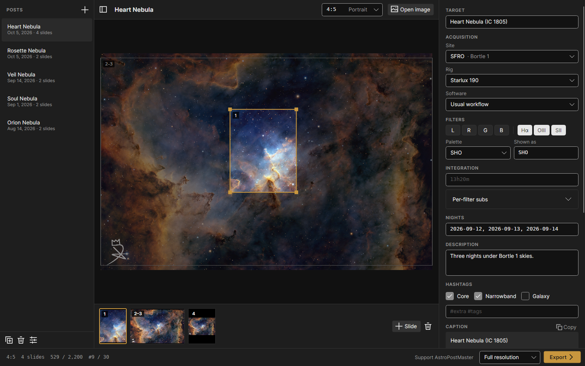
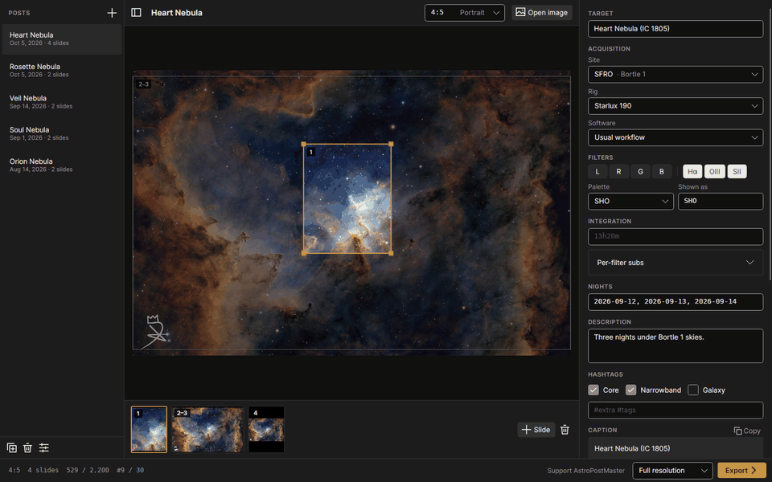
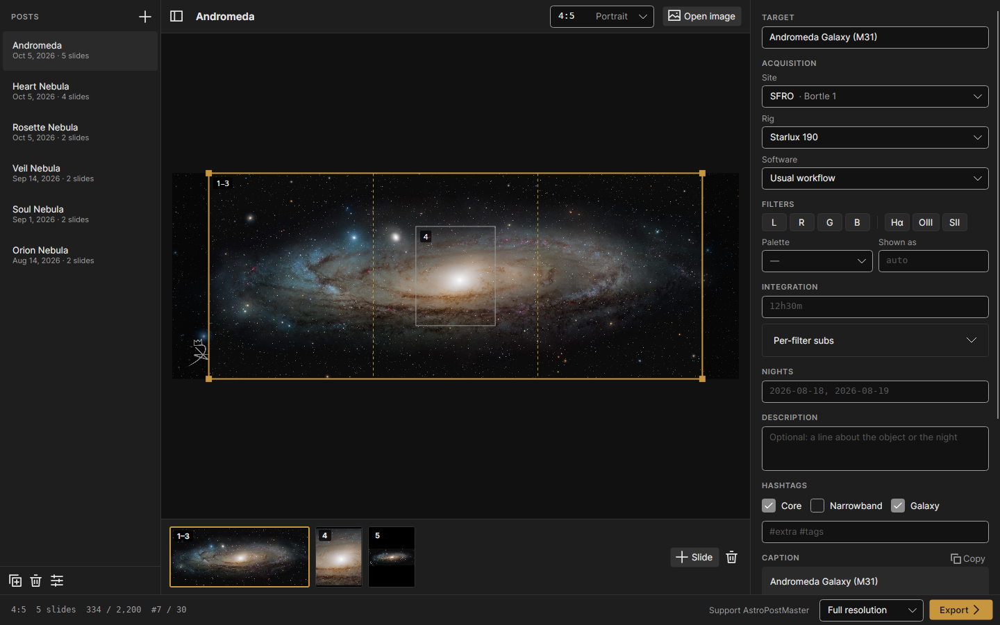
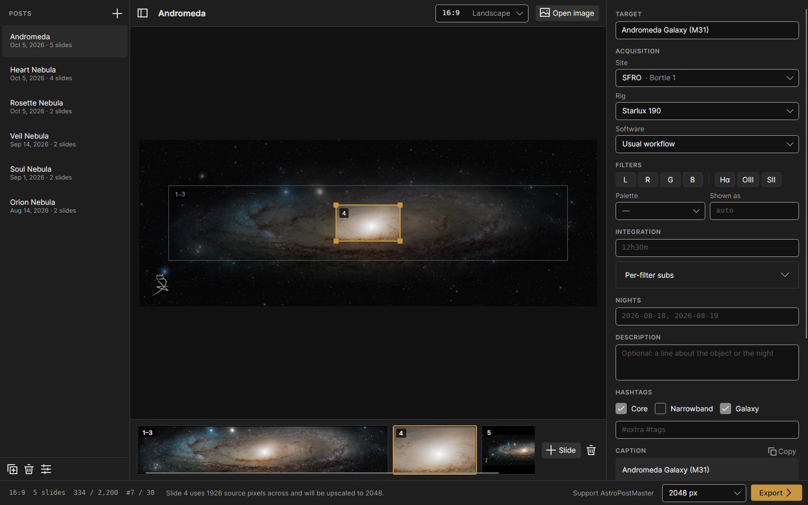
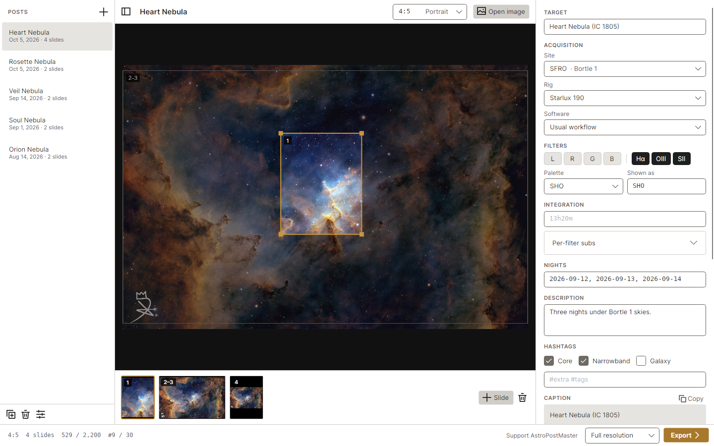
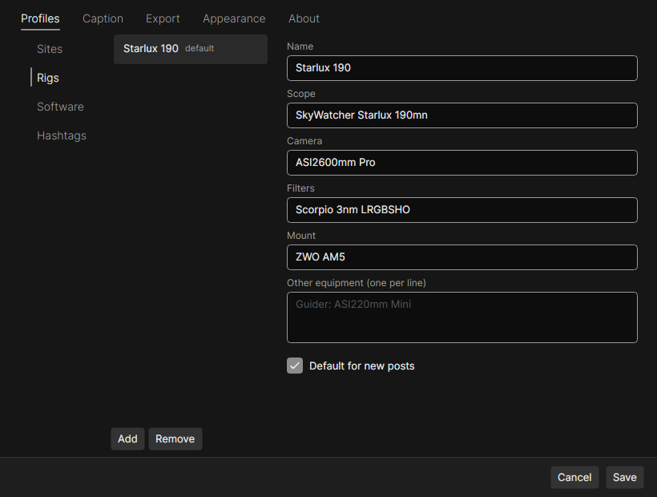
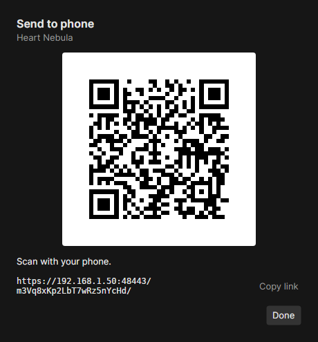
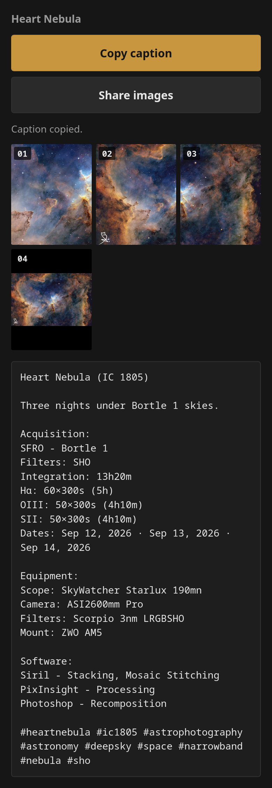
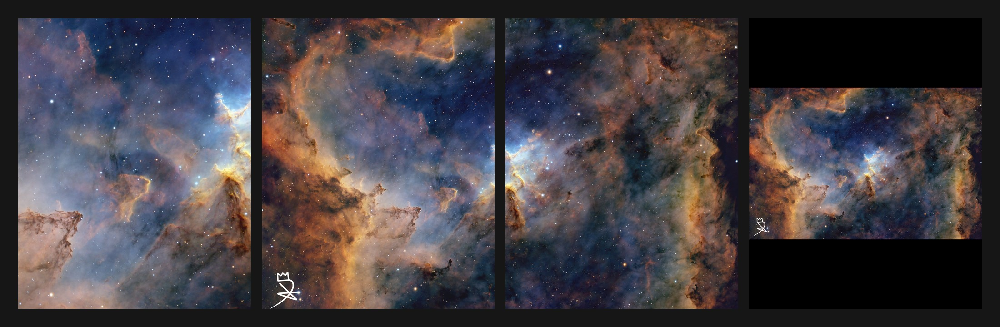

<div align="center">

# AstroPostMaster

**Turn a finished astrophoto into a ready-to-post carousel and caption, then send it to your phone with one scan.**

[](https://github.com/YoruDev-Ryland/AstroPostMaster/actions/workflows/ci.yml)
[](LICENSE)




</div>

## Why

Posting astrophotography usually means copying files to a phone, cropping them in another app, typing out the same acquisition details and hashtags every time, and then posting. AstroPostMaster does the preparation on your computer, where your images already live. Your site, rig and software are saved once, so a typical post only needs the target, the filters and the integration time.

Nothing is uploaded anywhere. The phone fetches the finished slides and caption straight from your computer over your own Wi-Fi.

## Features

**Slides**
- Detail crops, seamless panorama splits (2 to 5 slides), and the full image, all in one carousel
- Portrait (4:5, 3:4, 2:3), square (1:1) and landscape (4:3, 3:2, 16:9, 1.91:1) shapes
- Full-resolution export by default, or 4096, 2048 or 1080 px for sites that resize anyway
- Proper sRGB conversion, so Adobe RGB and wide-gamut exports don't look washed out
- Reads JPG, PNG and TIFF, including 16-bit TIFF and very large mosaics
- Optional watermark
- Zoom in with the mouse wheel to place a crop precisely on a small object
- Slideshow preview that plays the carousel inside the app window

**Captions**
- Reusable profiles for sites, rigs, software and hashtag sets, with defaults filled in automatically
- Built-in catalog of about 13,000 objects (Messier, Caldwell, NGC/IC, Sharpless, LDN/LBN, Barnard)
- Guesses the target from the file name, so `Heart Nebula-1102250103.jpg` becomes *Heart Nebula (IC 1805)* with matching hashtags
- Filter chips that build strings like `RGBHOO` or `LRGBSHO`
- Integration time as a total or per filter, nights, and optional moon phase
- Fully editable caption template

**Posts**
- Lock a post to keep it exactly as it was posted, or lock automatically after every export
- Duplicate a post with all its slides, then swap in a new image to compare versions with identical crops
- The last slide size you picked becomes the default for new posts

**Phone handoff**
- Scan a QR code and the phone opens a page with **Copy caption** and **Share images**
- The images arrive in carousel order, ready for Instagram or anywhere else
- Built-in firewall check for Windows, macOS and Linux that can open the port for you, with your permission

## In action

<div align="center">

</div>

## Screenshots

| Panorama across three slides | Landscape at 16:9 |
|:---:|:---:|
|  |  |
| **Light theme** | **Profiles** |
|  |  |

**From the computer to the phone**

<table>
<tr>
<td align="center" width="50%"><br><sub>Scan the code</sub></td>
<td align="center" width="50%"><br><sub>Copy the caption, share the images</sub></td>
</tr>
</table>

**The exported carousel**



## Download

Prebuilt downloads for Windows, macOS and Linux will be on the [Releases](https://github.com/YoruDev-Ryland/AstroPostMaster/releases) page. Each one is a single self-contained file with nothing to install. Until the first release, build from source (below).

On Windows, SmartScreen may warn that the app is unrecognized because it isn't code-signed yet. Choose **More info**, then **Run anyway**.

## Getting started

1. **Add your profiles.** Open Settings and add your site (with Bortle class), rig, software and a few hashtag sets. Mark the ones you use most as defaults.
2. **Open an image.** Drag a finished image onto the window or use **Open image**. The target is filled in when it can be guessed from the file name.
3. **Build the carousel.** Pick a shape, then add slides. Press `C` for a crop or `P` for a 3-slide panorama; more options are under **+ Slide**. Drag frames to move them, drag a corner to resize, and drag thumbnails to reorder. Scroll to zoom, drag with the right mouse button (or hold Space) to pan, and press `0` to fit again. `F5` plays the slideshow.
4. **Fill in the details.** Tap your filters, enter the integration time and, if you like, the nights and a short description.
5. **Send it.** Choose a slide size next to **Export**, then **Export ▸ Send to phone** and scan the code. Copy the caption, share the images, add a song in Instagram and post.

You can also export to a folder (slides plus `caption.txt`) or just copy the caption.

### If your phone can't connect

The app checks your firewall when you send to a phone, and you can run the same check from **Settings ▸ Export ▸ Check phone connection**. If the firewall is in the way, **Allow on my home network** adds a rule that only lets devices on your local network reach the app's port. Your system asks for your password or admin approval first, and **Copy command** gives you the same change to run yourself.

Beyond that, make sure the phone is on the same Wi-Fi as the computer (not a guest network), and accept the one-time certificate warning on the phone. The certificate is created by the app on your computer.

## Building from source

Requires the [.NET 10 SDK](https://dotnet.microsoft.com/download).

```bash
git clone https://github.com/YoruDev-Ryland/AstroPostMaster.git
cd AstroPostMaster
dotnet test                                     # run the test suite
dotnet run --project src/AstroPostMaster.App    # start the app
scripts/publish.sh                              # single-file builds in publish/
```

`scripts/publish.sh` takes runtime identifiers (`linux-x64`, `win-x64`, `osx-arm64`, `osx-x64`) and writes a zip for each.

### Project layout

| Project | Purpose |
|---|---|
| `src/AstroPostMaster.Core` | Models, caption templating, target catalog, slide geometry and storage. No dependencies. |
| `src/AstroPostMaster.Imaging` | Decoding (SkiaSharp, LibTiff.NET), slide rendering and JPEG export |
| `src/AstroPostMaster.Handoff` | The local phone page server, certificate, QR code and firewall check |
| `src/AstroPostMaster.App` | The Avalonia desktop app |
| `tools/AstroPostMaster.Screenshots` | Renders the app headlessly; produced the images in this README |
| `tools/build_catalog.py` | Rebuilds the target catalog from OpenNGC |

Settings, profiles and posts are stored as plain JSON in `%APPDATA%\AstroPostMaster`, `~/Library/Application Support/AstroPostMaster` or `~/.config/AstroPostMaster`. Your original images are never modified.

## Support

AstroPostMaster is free. If it saves you time, you can support development on [Ko-fi](https://ko-fi.com/rkremeier).

## License

Released under the [MIT License](LICENSE).

The target catalog is derived from [OpenNGC](https://github.com/mattiaverga/OpenNGC) by Mattia Verga and is distributed under CC-BY-SA-4.0. See [THIRD-PARTY-NOTICES.md](THIRD-PARTY-NOTICES.md).
